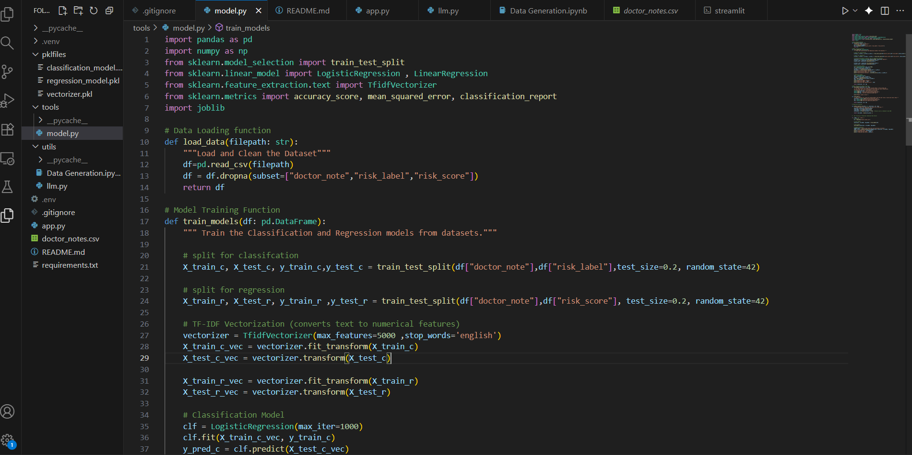
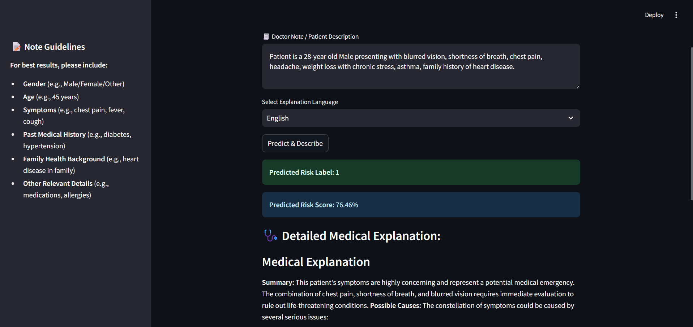

# 🩺 MediNote AI — Intelligent Healthcare Assistant using ML & GenAI

**MediNote AI** is an intelligent healthcare analysis system that combines the power of **Machine Learning (ML)** and **Generative AI (GenAI)** to predict patient health conditions and generate detailed medical summaries.  
This project showcases how predictive analytics and large language models can work together to make healthcare insights more explainable, accessible, and human-like.


## 📘 Table of Contents
1. [Overview](#-overview)
2. [Project Highlights](#-project-highlights)
3. [Architecture](#-architecture)
4. [Tech Stack](#-tech-stack)
5. [Workflow](#-workflow)
6. [Machine Learning Models](#-machine-learning-models)
7. [Generative AI Integration](#-generative-ai-integration)
8. [Results & Insights](#-results--insights)
9. [Installation](#-installation)
10. [Usage](#-usage)
11. [Future Improvements](#-future-improvements)
12. [Screenshots](#-screenshots)
13. [Author](#-author)
14. [License](#-license)

## 🧠 Overview
**MediNote AI** simulates a *digital medical assistant* that can:
- Analyze patient health parameters using trained ML models  
- Predict the likelihood of a medical condition or risk  
- Generate a human-like explanation of the condition using a **Generative AI model (Gemini LLM)**  

It is designed to demonstrate how **AI-driven predictions** and **LLM-based narratives** can assist healthcare professionals and improve patient understanding.

## 🌟 Project Highlights

- 🧩 Combines **Linear Regression** and **Logistic Regression** models for medical prediction  
- 🤖 Integrates **Gemini LLM** to generate descriptive medical summaries  
- 📊 Uses **synthetic datasets** (self-generated) for training and testing  
- ⚙️ Built with **Python**, **Scikit-learn**, **Pandas**, **NumPy**, and **Google Gemini API**  
- 💬 Produces detailed patient reports explaining symptoms, causes, and recommendations  
- 📈 Modular design for scalability and real-world integration  

## 🏗 Architecture

Patient Data Input ➜ Machine Learning Model (Prediction) ➜ Gemini LLM ➜ Medical Report Generation


1. **Input Layer:** Accepts patient data (age, symptoms, vitals, etc.)  
2. **ML Layer:** Linear & Logistic Regression models analyze and predict outcomes  
3. **LLM Layer:** Gemini LLM generates a complete textual explanation  
4. **Output Layer:** Final report summarizing patient condition and recommendations  

## 🧰 Tech Stack

| Category | Tools/Technologies |
|-----------|--------------------|
| Programming Language | Python |
| ML Libraries | Scikit-learn, Pandas, NumPy |
| Generative AI | Gemini LLM (Google AI) |
| Data | Synthetic dataset (custom-generated) |
| IDE | VS Code / Jupyter Notebook |
| Visualization | Matplotlib / Seaborn (optional) |


## ⚙️ Workflow

1. **Data Preparation** – Synthetic data generated for testing ML models.  
2. **Model Training** – Linear & Logistic Regression trained on synthetic data.  
3. **Prediction** – The model predicts patient risk or condition.  
4. **LLM Integration** – Prediction results passed to Gemini LLM.  
5. **Medical Summary Generation** – LLM outputs a detailed patient condition note.  
6. **Visualization (optional)** – Display results or confidence metrics.  

## 🧩 Machine Learning Models

### 1. Linear Regression
Used to predict **continuous variables** such as patient health scores or condition severity.

### 2. Logistic Regression
Used to classify **categorical outcomes**, e.g., "High Risk" vs "Low Risk" patients.

Both models were trained using custom-generated synthetic data to simulate realistic healthcare scenarios.

## 💬 Generative AI Integration

After predictions are made by ML models, the results are sent to **Google’s Gemini LLM**, which:
- Interprets the numerical results
- Generates a **human-readable medical explanation**
- Provides potential causes, symptoms, and recommendations  

This step transforms technical predictions into understandable narratives for patients and doctors.


## 📊 Results & Insights

- Accurate classification and prediction on synthetic test data  
- Meaningful, context-rich medical summaries generated automatically  
- Demonstrates how ML + LLM synergy can improve healthcare explainability  


## 🛠 Installation

To set up the project locally:

```bash
# Clone the repository
git clone https://github.com/Atharv-M/MediNote-AI-.git

# Navigate to the project folder
cd MediNote-AI-

# Install dependencies
pip install -r requirements.txt
````

**Note:** Ensure you have an active API key for **Gemini LLM** and store it in an `.env` file as:

```
GOOGLE_API_KEY=your_api_key_here
```


## 🚀 Usage

```bash
# Run the model training script
python train_models.py

# Run the main application
python medinote_ai.py
```

Once executed, MediNote AI will:

* Train or load the ML models
* Predict patient conditions
* Generate a detailed report using Gemini LLM

---

## 🔮 Future Improvements

* Integrate real-world anonymized patient data
* Add more complex ML algorithms (Random Forest, XGBoost)
* Build a web dashboard for live interaction and visualization
* Deploy using Streamlit or Flask for user-friendly access

---

## 🖼 Screenshots

| Model Training                              | AI Response Generation                 |
| ------------------------------------------- | -------------------------------------- |
|  |  |


## 👨‍💻 Author

**Developed by [Atharv M](https://github.com/Atharv-M)**
Passionate about **Machine Learning**, **Generative AI**, and **Applied AI Systems** for real-world impact.
Feel free to connect on [LinkedIn](https://www.linkedin.com/in/) and share feedback or collaboration ideas!

---

## 📜 License

This project is licensed under the **MIT License**.
You are free to use, modify, and distribute this project for educational and research purposes.


### ⭐ If you like this project, don’t forget to **star** the repository and share it with others interested in AI & Healthcare Innovation!

```

